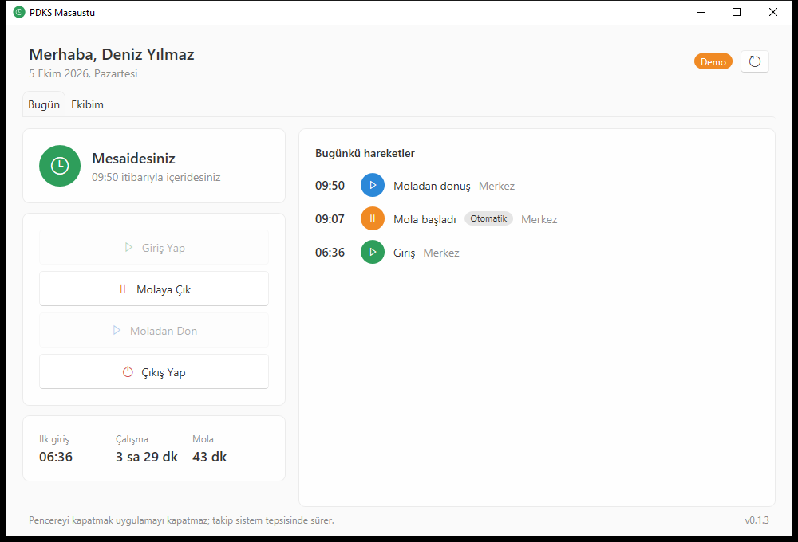
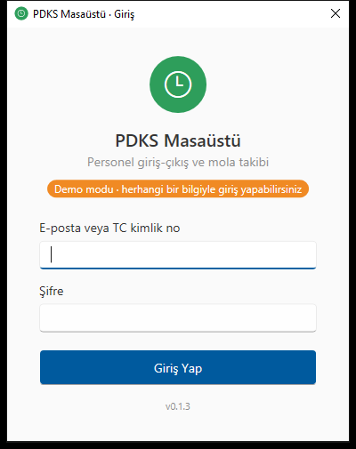
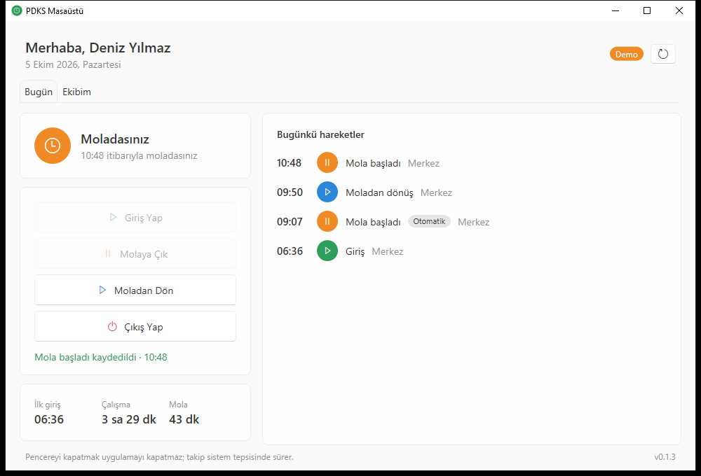
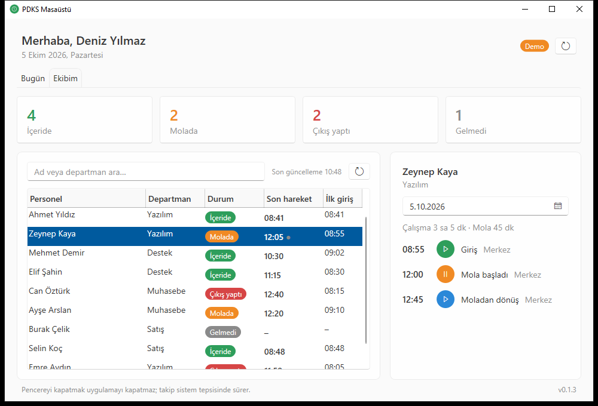
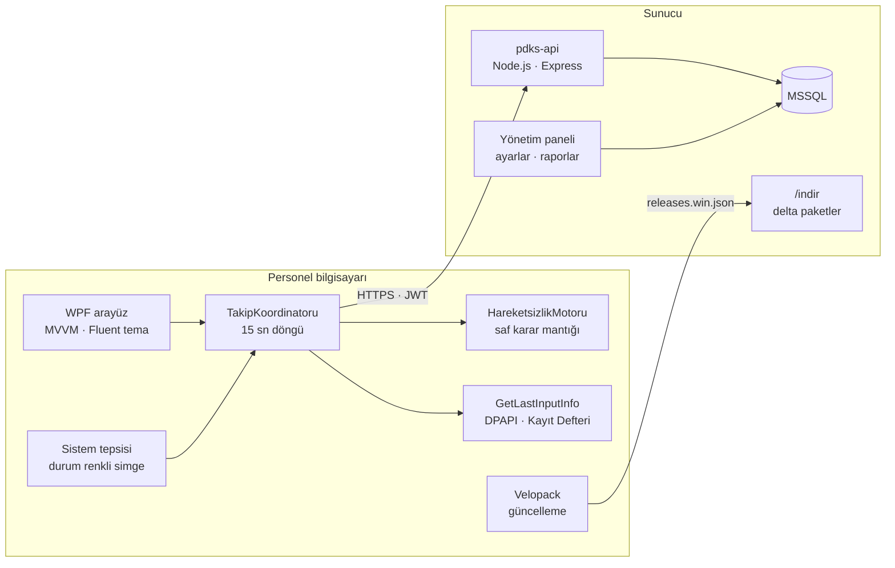
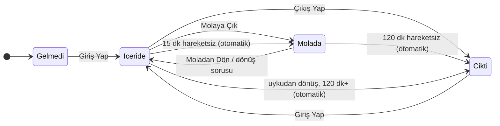

<div align="center">


# PDKS Masaüstü

**Personel giriş-çıkış ve mola takibi için Windows masaüstü uygulaması**

Klavye/fare hareketsizliğinden otomatik mola ve çıkış · Yönetici ekip paneli · Sessiz delta güncelleme

[](https://github.com/Batuhan-Kahraman35/pdks-masaustu/actions/workflows/derleme.yml)




</div>

## Neden?

QR okutmalı mobil PDKS sahada iyi çalışır, ama gün boyu bilgisayar başında çalışan personel için iki boşluk bırakır: **molaya çıkıldığı unutulur** ve **akşam çıkış yapılmaz**. Bu uygulama sistem tepsisinde sessizce durur; tek tıkla giriş/çıkış/mola sunar ve personel bilgisayardan uzaklaştığında durumu kendiliğinden kaydeder.

## Özellikler

| | |
|---|---|
| ⏱️ **Tek tıkla hareket** | Giriş, mola, moladan dönüş, çıkış. O an yapılamayan işlemler pasiftir. |
| 💤 **Hareketsizlik algılama** | 15 dk işlem yoksa mola, 120 dk olursa çıkış yazılır. Kayıt saati tespit anı değil **son klavye/fare hareketidir**. |
| 👋 **Akıllı dönüş** | Moladan dönen personele sağ altta "Moladan dön" sorulur; butona basıp masada kalana sorulmaz. |
| 👥 **Ekibim** | Yönetici, bağlı tüm kademeleri anlık durum, özet sayılar ve gün gün hareket geçmişiyle görür. |
| 🔄 **Sessiz güncelleme** | Yeni sürüm arka planda iner (delta: ~200 KB), personel bilgisayardan ayrıldığında kurulur. Yönetici yetkisi gerekmez. |
| 🎛️ **Merkezi ayar** | Eşik süreleri sunucudaki yönetim panelinden değişir; yeni sürüm gerekmez. |
| 🎨 **Marka** | Uygulama adı yapılandırmadan, logo portalın marka ayarından çalışma anında gelir. |
| 🧪 **Demo modu** | `--demo` ile sunucusuz çalışır; uydurma bir ekip ve gün üretir. |

<table>
  <tr>
    <td></td>
    <td></td>
  </tr>
  <tr>
    <td colspan="2"></td>
  </tr>
</table>

## Mimari



Proje iki katmana ayrılmıştır:

- **`PdksMasaustu.Core`**: Platformdan bağımsız iş mantığı (API istemcisi, hareketsizlik motoru, gün özeti, oturum kasası). Windows'a dokunmaz; zaman `TimeProvider`, son girdi `ISonGirdiKaynagi` ile dışarıdan verildiği için **her senaryo birim testle** doğrulanır.
- **`PdksMasaustu`**: WPF arayüz ve Windows'a özgü parçalar (tepsi, `GetLastInputInfo`, DPAPI, otomatik başlatma, Velopack).

### Hareketsizlik kararları



| Durum | Koşul | Karar |
|---|---|---|
| İçeride | 15 dk hareketsiz | Mola, **son hareket saatiyle** |
| İçeride | 120 dk+ (uyku/kilit sonrası) | Doğrudan çıkış |
| Molada | 120 dk hareketsiz | Çıkış (açık mola kapatılır) |
| Molada | Masadan ayrılıp dönüldü | "Moladan dön" sorusu, her mola için bir kez |
| Gelmedi / sistemce çıkarıldı | Bilgisayar kullanılıyor | "Mesaiye başla" hatırlatması, en fazla 30 dk'da bir |
| Elle çıkış yapmış | Bilgisayar kullanılıyor | Rahatsız edilmez |

Otomatik kayıtlar sunucuda da doğrulanır: gelecekte olamaz, eşikten eski olamaz, günün son kaydından önceye düşemez. Sunucunun reddettiği karar, durum değişene kadar tekrar gönderilmez.

## Teknik notlar

- **Gizlilik:** Klavye kancası kurulmaz; `GetLastInputInfo` yalnız "en son ne zaman" bilgisini verir, tuş içeriği hiç görülmez.
- **Çift kayıt koruması:** HTTP istekleri `Microsoft.Extensions.Http.Resilience` ile yeniden denenir, ancak **POST hiç tekrar denenmez**; yanıtı kaybolan bir hareket iki kez yazılmaz.
- **Oturum güvenliği:** JWT, Windows DPAPI ile kullanıcıya bağlı şifrelenerek saklanır; dosya başka hesaba kopyalansa çözülemez.
- **Tek örnek:** İkinci kez açılmaya çalışılırsa çalışan örnek öne gelir (`Mutex` + `EventWaitHandle`).
- **Güncelleme ve veri:** Kullanıcı verisi kurulum klasöründen ayrı (`%AppData%`) tutulur; Velopack güncellemede kurulum klasörünü baştan yazar.
- **Kod kalitesi:** `TreatWarningsAsErrors`, `Nullable`, kaynak üreticili MVVM (`CommunityToolkit.Mvvm`), `LibraryImport`.

## Teknolojiler

| Katman | Kullanılan |
|---|---|
| Çatı | .NET 10 (LTS), C# 14 |
| Arayüz | WPF, Fluent tema (`ThemeMode="System"`, açık/koyu), H.NotifyIcon |
| Altyapı | Generic Host, Dependency Injection, Options, `HttpClient` + Resilience |
| Güncelleme | Velopack (delta paketler, kullanıcı bazında kurulum) |
| Test | xUnit, `FakeTimeProvider` |
| CI | GitHub Actions |

## Proje yapısı

```
src/
  PdksMasaustu.Core/     İş mantığı: Api/, Hareketsizlik/, Takip/, Oturum/, Modeller/
  PdksMasaustu/          WPF: Gorunumler/, GorunumModelleri/, Tepsi/, Altyapi/, Demo/
tests/
  PdksMasaustu.Tests/    Motor, koordinatör, API istemcisi, gün özeti, oturum kasası
araclar/
  yayinla.ps1            Test → publish → Velopack paket → yayın klasörü
  ikon-uret.ps1          Çok boyutlu .ico üretimi (genel ya da logodan)
```

## Çalıştırma

```powershell
# Sunucusuz deneme
dotnet run --project src/PdksMasaustu -- --demo

# Gerçek sunucuyla
copy appsettings.example.json src\PdksMasaustu\appsettings.json   # adresleri düzenleyin
dotnet run --project src/PdksMasaustu

dotnet test
```

### Yayın

```powershell
dotnet tool install -g vpk
$env:PDKS_YAYIN_KLASORU = "\\sunucu\indir\pdks-masaustu"
.\araclar\yayinla.ps1 -Surum 1.2.0 -SurumNotu "Ekibim sekmesine arama eklendi"
```

Betik testleri çalıştırır (başarısızsa durur), self-contained paket ve önceki sürüme göre delta üretir, yayın klasörüne önce paketleri sonra sürüm listesini kopyalar. Personel `Setup.exe` ile bir kez kurar; sonrası kendiliğinden güncellenir.

## Sunucu tarafı

Uygulama, aşağıdaki uç noktaları sunan bir PDKS API'sine bağlanır (taban adres `appsettings.json` içinde):

| Uç nokta | Açıklama |
|---|---|
| `POST auth/login` | E-posta / TC kimlik no + şifre → JWT |
| `GET ayarlar` | Marka ayarları (başlık, logo) |
| `GET masaustu/durum` | Bugünkü kayıtlar, durum, eşik süreleri |
| `POST masaustu/hareket` | `{ tip, otomatik?, zaman? }` |
| `GET masaustu/ekip/durum` | Kapsamdaki personelin anlık durumu |
| `GET masaustu/ekip/gecmis` | Seçilen personelin günlük hareketleri |

## Lisans

[MIT](LICENSE) © [Batuhan KAHRAMAN](https://github.com/Batuhan-Kahraman35)
